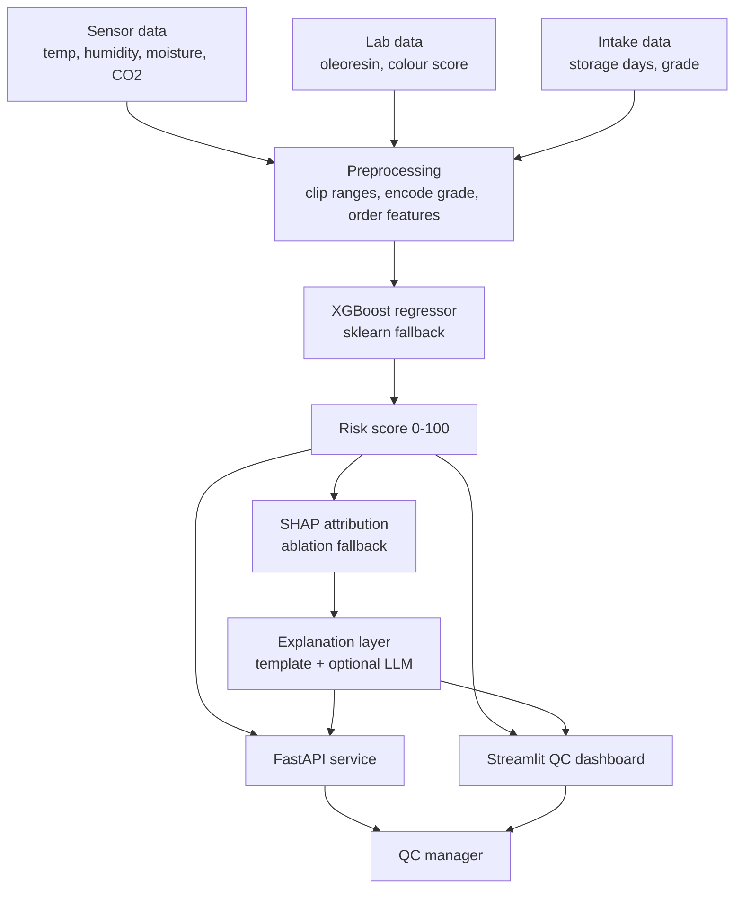

# LotIQ — Architecture & Design Notes

This document explains *how* LotIQ works and, more importantly, *why* it's built
the way it is. The design choices here are what separate a legitimate prototype
from an attractive random-number generator.

## Pipeline



## Component map

| Concern              | Module                          | Notes |
|----------------------|---------------------------------|-------|
| Config / schema      | `lotiq.config`                  | Single source of truth: features, thresholds, risk bands, generator coefficients. |
| Synthetic data       | `lotiq.data.generate`           | Domain-informed simulator (see below). |
| Preprocessing        | `lotiq.data.preprocessing`      | Raw record → ordered numeric feature vector; shared by training and serving. |
| Training             | `lotiq.models.train`            | XGBoost or sklearn; saves a self-describing bundle + metrics. |
| Prediction           | `lotiq.models.predict`          | `score_record()` — the one entry point API and dashboard both call. |
| Risk bands           | `lotiq.models.risk`             | Score → level, colour, emoji, recommended action. |
| Attribution          | `lotiq.explain.attribution`     | SHAP or ablation, one interface. |
| Explanation          | `lotiq.explain.explainer`       | Contributions → plain language; optional Anthropic LLM. |
| API                  | `api.main`                      | Thin FastAPI transport over `score_record`. |
| Dashboard            | `dashboard.app`                 | Streamlit; reads the warehouse snapshot, scores new lots live. |

## The synthetic data-generating process

Because there is no real seed data yet, LotIQ generates data from domain
knowledge rather than learning a distribution from samples (which is why a
"learn-then-sample" tool such as SDV isn't the right fit here). The generator:

1. Draws an **intake grade** (A/B/C) that sets baseline colour, oleoresin and
   moisture.
2. Draws **storage time** from a Gamma distribution.
3. Draws a per-lot **micro-climate** (temperature, humidity).
4. Derives **moisture ingress** that grows with humidity exposure over time.
5. Derives a **CO₂ / respiration proxy** rising with time, heat and moisture.
6. Degrades **colour** and **oleoresin** with time and heat.

This chain induces realistic *correlations* between features (e.g. long storage in
a humid zone → higher moisture → higher CO₂), rather than independent noise.

### Why the label is deliberately noisy

The `risk_score` is:

```
drivers   = Σ  wᵢ · zᵢ           (zᵢ = standardised feature i, wᵢ = domain weight)
logit     = scale · (drivers − centre) + latent + noise
risk_score = 100 · sigmoid(logit)
```

where `latent ~ N(0, σ_latent)` is an **unobserved** factor (think: supplier-
specific microbial load we never measure) and `noise ~ N(0, σ_noise)` is
measurement noise.

The unobserved terms are the whole point. If `risk_score` were a deterministic
threshold rule on the visible features, a gradient-boosted tree would memorise
that rule and SHAP would simply recite it — a circular, scientifically empty
demonstration. By making the label only *partly* recoverable from the features,
we get:

- a genuine, learnable signal with **irreducible error** (test R² ≈ 0.85, not 1.0),
- evaluation numbers that mean something, and
- SHAP attributions that vary smoothly across lots, as they would on real data.

All coefficients live in `config.GenerationConfig` and are easy to tune.

## Model

- **Primary:** `XGBoost` regressor — strong on small tabular data, with L1/L2
  regularisation to resist overfitting and exact, fast SHAP via `TreeExplainer`.
- **Fallback:** scikit-learn `HistGradientBoostingRegressor` — also a regularised
  gradient-boosted tree ensemble, chosen so the pipeline runs even where the
  XGBoost wheel is unavailable. The active backend is stored in the model bundle
  and `metrics.json`.

Training does an 80/20 split, reports 5-fold CV MAE (to show the gap between
train and test is small), and evaluates MAE / RMSE / R² plus a business-friendly
**risk-band accuracy** (did we put the lot in the right bucket?).

The saved artefact is a *bundle*: the model, the backend name, the exact feature
order, the commodity, and per-feature training medians (the "typical lot" baseline
the ablation explainer needs). Prediction never has to guess how the model was built.

## Explainability

Two backends, one sign convention (positive contribution ⇒ raises this lot's risk
above a typical lot):

- **SHAP** (`TreeExplainer`) when XGBoost + `shap` are available. SHAP values for a
  regressor are already in output units (risk points) and are additive.
- **Ablation** otherwise: start from a typical (median) lot and substitute one
  feature at a time with this lot's value; the change in predicted score is the
  contribution. Stable and correctly signed even when the model saturates at 0/100
  — unlike perturbing *down* from an already-extreme prediction. It ignores feature
  interactions (SHAP doesn't), which is exactly why SHAP is preferred.

The explanation text is **threshold-aware**: it claims a value "crossed the safe
limit" only when `exceeds_threshold` is true; otherwise it says the value is
higher/lower than a typical lot.

## Serving

- **API** (`api/main.py`): FastAPI + Pydantic. Loads the bundle once, validates
  input, returns score + drivers + explanation. Swagger UI at `/docs`.
- **Dashboard** (`dashboard/app.py`): Streamlit. A warehouse overview (health
  metrics + colour-coded, risk-sorted lot table), a per-lot detail view (gauge,
  sensor readings, contribution bar, illustrative risk trend, recommendation), and
  a live "score a new lot" form that calls the same model.

Both go through `lotiq.models.predict.score_record`, so they can never disagree on
how a lot is scored.
